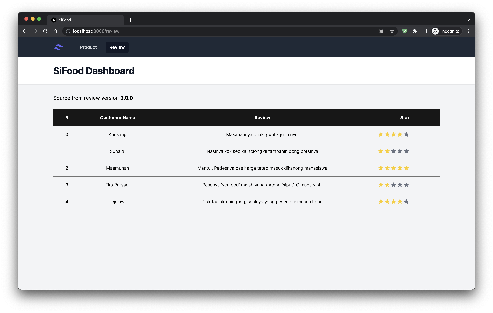

# demo-istio



This application used for demo and simulate Istio in Kubernetes. You can pull all applicaiton from [my Docker](https://hub.docker.com/r/rahadiangg/demo-istio/tags) repository.


There a 3 service is here such as `dashboard-svc` for frontend, also `product-svc` and `review-svc` for backend. Dashboard-svc will show data from product-svc & review-svc. In dashboard-svc you must define env variables for URI endpoint backend application. This what env that you can set:

```
PRODUCT_URI=http://localhost/products
REVIEW_URI=http://localhost/reviews
```
## Port

For `dashboard-svc` will working on port 3000 and both of backend working on port 8000
## Simulate canary / AB testing

To simulate canary or AB testing deployment you can use `review-svc`. There is 3 version for `review-svc` such as:

### 1.0.0

Stable version for fist deployment

### 2.0.0

Crash version, this version will return error 500. Think like you want create new feature but when deployed it's not working fine.

### 3.0.0

New feature with stable version. Think like hot fix for version 2.0.0